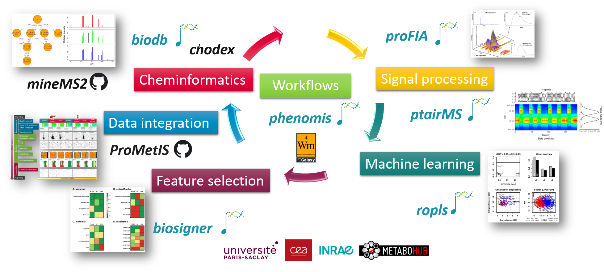

## Welcome to the Data Science Team website

For more than 15 years, our team based at **CEA Saclay** has been developing innovative methods and software in **metabolomic data science for health**. Our know-how and the digital ecosystem we have built cover all steps from **signal processing** of **mass spectrometry data**, **machine learning**, **variable selection**, **data integration**, **annotation** and up to reproducible **workflow management**.

{width="673"}

###### Last update: 2022-11-13
