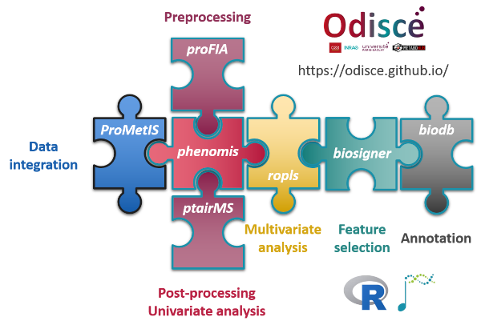

**R packages**

*   **biodb**: a library and a development framework for connecting to chemical and biological databases (by Pierrick Roger; [DOI:10.18129/B9.bioc.biodb](https://doi.org/doi:10.18129/B9.bioc.biodb))
    
*   **biosigner**: signature discovery from omics data (in collaboration with Philippe Rinaudo; [DOI:10.18129/B9.bioc.biosigner](https://doi.org/10.18129/B9.bioc.biosigner))
    
*   **phenomis**: post-processing and univariate analysis of MS data ([https://github.com/SciDoPhenIA/phenomis](https://github.com/SciDoPhenIA/phenomis))
    
*   **proFIA**: preprocessing of FIA-HRMS data (by Alexis Delabriere; [DOI:10.18129/B9.bioc.proFIA](https://doi.org/10.18129/B9.bioc.proFIA))
    
*   **ProMetIS**: multi-omics phenotyping of the LAT and MX2 knockout mice (with Alyssa Imbert and the ProMetIS consortium; [https://github.com/IFB-ElixirFr/ProMetIS](https://github.com/IFB-ElixirFr/ProMetIS))
    
*   **ptairMS**: Pre-processing PTR-TOF-MS Data (by Camille Roquencourt; [DOI:10.18129/B9.bioc.ptairMS](https://doi.org/10.18129/B9.bioc.ptairMS))
    
*   **ropls**: PCA, PLS(-DA) and OPLS(-DA) for multivariate analysis and feature selection of omics data ([DOI:10.18129/B9.bioc.ropls](https://doi.org/10.18129/B9.bioc.ropls))
    

**Datasets; [MetaboLights](http://www.ebi.ac.uk/metabolights/index) repository**

*   [MTBLS1903](https://www.ebi.ac.uk/metabolights/MTBLS1903): ProMetIS: deep phenotyping of knock-out mice by proteomics and metabolomics.
    
*   [MTBLS404](https://www.ebi.ac.uk/metabolights/MTBLS404): Analysis of the human adult urinary metabolome variations with age, body mass index and gender by implementing a comprehensive workflow for univariate and OPLS statistical analyses ('Sacurine' data set).
    
*   [MTBLS148](https://www.ebi.ac.uk/metabolights/MTBLS148): Impact of collection conditions on the metabolite content of human urine samples as analyzed by liquid chromatography coupled to mass spectrometry and nuclear magnetic resonance spectroscopy.
    

**Galaxy modules; [Galaxy](https://toolshed.g2.bx.psu.edu) toolshed**

*   Batch Correction (in collaboration with Jean-Francois Martin, Melanie Petera, Marion Landi and Franck Giacomoni)
    
*   Biosigner (in collaboration with Philippe Rinaudo)
    
*   Heatmap
    
*   Multivariate
    
*   proFIA (in collaboration with Alexis Delabriere)
    
*   Quality Metrics (in collaboration with Melanie Petera)
    
*   Univariate (in collaboration with Marie Tremblay-Franco)
    

**Workflows and histories; [Workflow4Metabolomics](http://workflow4metabolomics.org/referenced_W4M_histories) e-infrastructure**

*   W4M00001\_Sacurine-statistics ([DOI:10.15454/1.4811121736910142E12](http://dx.doi.org/10.15454/1.4811121736910142E12))
    
*   W4M00002\_Sacurine-comprehensive ([DOI:10.15454/1.481114233733302E12](http://dx.doi.org/10.15454/1.481114233733302E12))
    
*   W4M00003\_Diaplasma ([DOI:10.15454/1.4811165052113186E12](http://dx.doi.org/10.15454/1.4811165052113186E12))